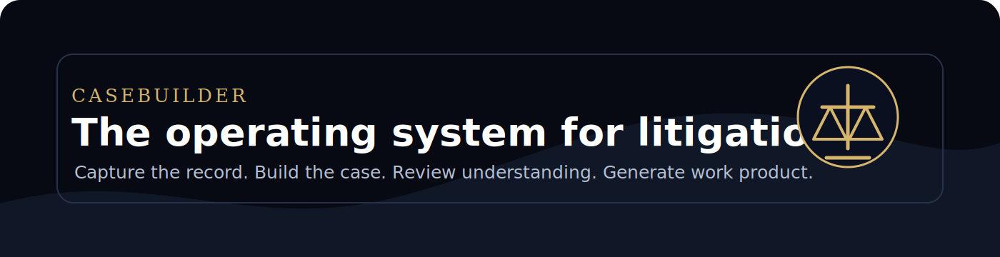
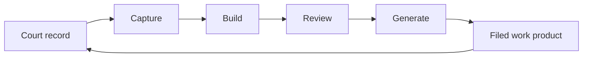
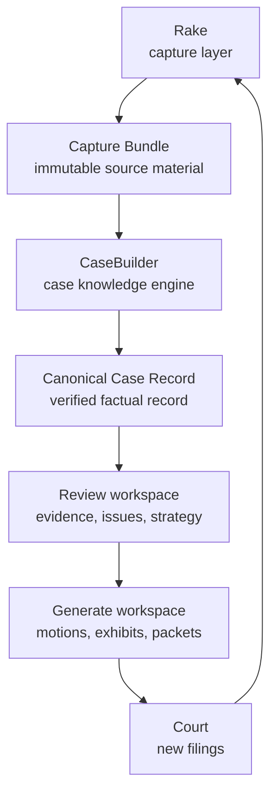

<p align="center">
  
</p>

<p align="center">
  <strong>The operating system for litigation.</strong><br />
  Build complete case knowledge from court records.
</p>

<p align="center">
  <a href="PRODUCT.md">Product</a> ·
  <a href="ARCHITECTURE.md">Architecture</a> ·
  <a href="ROADMAP.md">Roadmap</a> ·
  <a href="docs/adr">ADRs</a>
</p>

---

## The thesis

Most legal software starts with drafting.

CaseBuilder starts with understanding.

Court records are not just documents. They are evidence, chronology, claims, parties, obligations, contradictions, authorities, and work product waiting to be organized.

CaseBuilder turns the record into a verified case knowledge base before anything is generated.

---

## The rule

```text
Evidence before opinion.
Understanding before drafting.
Review before generation.
People before automation.
```

---

## The loop



Every filed result becomes new source material.

The case gets stronger every time the loop runs.

---

## The system



---

## Workspaces

### Capture

Collect everything. Preserve the chain.

Powered by Rake.

### Build

Explode the record. Transcribe pages. Verify completeness.

Produces the Canonical Case Record.

### Review

Find the story inside the evidence.

Timelines, contradictions, gaps, exhibits, authorities, and strategy.

### Generate

Draft only from approved understanding.

Motions, discovery, declarations, appendices, and filing packets.

---

## What makes it different

CaseBuilder does not ask a lawyer to trust generated text.

It asks the lawyer to approve the system's understanding first.

That is the product.

---

## Project map

```text
casebuilder/
├── README.md
├── PRODUCT.md
├── ARCHITECTURE.md
├── ROADMAP.md
├── CONTRIBUTING.md
├── docs/
│   ├── adr/
│   ├── assets/
│   ├── diagrams/
│   └── product/
├── schemas/
│   ├── capture-bundle.schema.json
│   ├── canonical-case-record.schema.json
│   ├── review-packet.schema.json
│   └── filing-package.schema.json
└── packages/
    ├── capture/
    ├── build/
    ├── review/
    └── generate/
```

---

## Status

CaseBuilder is at the product architecture stage.

The current priority is to define the contracts between capture, build, review, and generation before collapsing implementation details into one codebase.

---

## Vision

CaseBuilder becomes the trusted workspace where every legal matter is collected, structured, reviewed, and improved.

Every page is traceable.

Every conclusion is grounded.

Every filing is generated from approved understanding.

The goal is not automated lawyering.

The goal is better lawyering.
