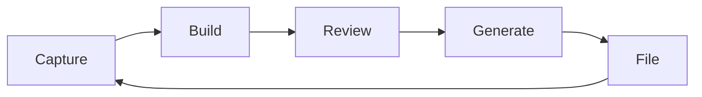
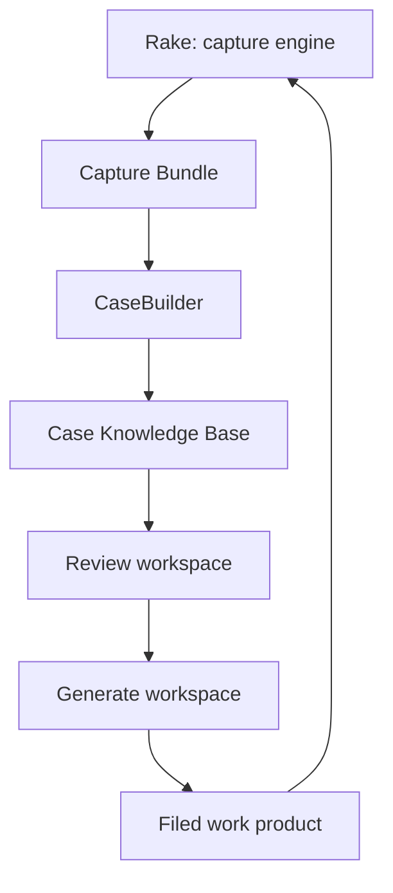
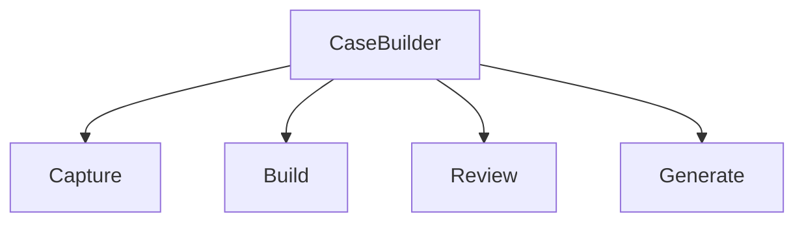
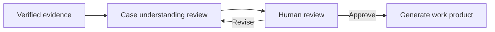
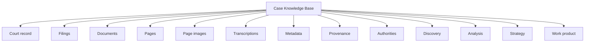
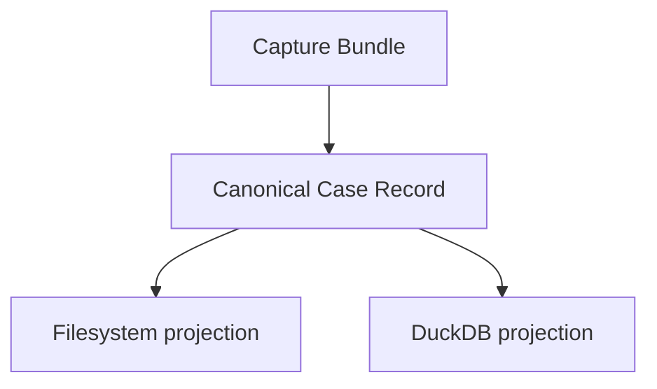
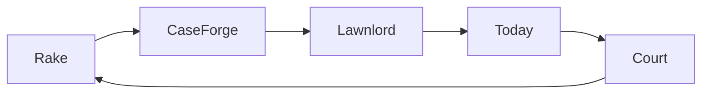

# CaseBuilder

<strong>Capture. Build. Review. Generate.</strong>

<em>Build complete, verified case knowledge from court records.</em>

---

> CaseBuilder transforms court records into a complete, verifiable case knowledge base that attorneys review before any filing is generated.

CaseBuilder is a legal workflow platform for collecting the record, building the case, reviewing understanding, and generating work product only after human approval.

---

## Why CaseBuilder?

Legal matters begin as scattered facts: court portals, filed PDFs, docket metadata, discovery, exhibits, emails, photos, contracts, prior research, and attorney notes.

Some documents have searchable text. Many are scanned images. Before legal work can begin, someone has to reconstruct the record.

CaseBuilder exists to perform that reconstruction once and improve it continuously as the matter changes.

---

## Product philosophy

**Understand the case before generating the filing.**

CaseBuilder does not ask attorneys to trust generated text. It asks them to review and approve the system's understanding of the case before work product is produced.

Understanding comes first. Generation comes second.

---

## The CaseBuilder loop

CaseBuilder is not a linear pipeline. Every new filing becomes new source material. Every stage can be revisited.

---

## Product architecture

---

## Workspaces

### Capture

Powered by Rake.

Capture collects and preserves source material.

- Connect
- Collect
- Pull
- Link
- Preserve provenance
- Produce the Capture Bundle

Capture never analyzes. It preserves reality.

### Build

Build transforms the Capture Bundle into a verified case knowledge base.

- Explode PDFs
- Detect filing, document, and page boundaries
- Render page images
- Extract searchable PDF text when available
- Add page-level transcription for scanned or image-only pages
- Preserve the provenance chain
- Compute quality metadata
- Verify completeness
- Build filesystem and DuckDB projections

Build does not argue. It constructs the factual foundation.

### Review

Review transforms evidence into understanding.

- Timeline reconstruction
- Financial reconstruction
- Evidence maps
- Filing chronology
- Contradiction detection
- Missing evidence discovery
- Authority organization
- Exhibit organization
- Strategy development

Review produces understanding, not filings.

### Generate

Generate transforms approved understanding into work product.

- Motions
- Responses
- Declarations
- Affidavits
- Discovery
- Appendices
- Exhibits
- Filing packets

Every generated statement must trace back to evidence.

---

## Human review gate

The attorney reviews the system's understanding of the case before generation begins.

The human may approve, reject, correct, add context, request more evidence, or request regeneration.

---

## Case Knowledge Base

Each knowledge domain evolves independently while remaining connected through provenance.

---

## Canonical Case Record

At the center of the knowledge base is the Canonical Case Record: a deterministic, verifiable representation of the factual record derived from the Capture Bundle.

The filesystem projection and DuckDB projection are equivalent renderings of the same Record. Neither projection is the source of truth. Both are reproducible.

---

## Ecosystem

| Project | Responsibility |
|---|---|
| Rake | Capture, collect, pull, link, and preserve provenance |
| CaseForge | Explode, transcribe, verify, and build the Canonical Case Record |
| Lawnlord | Review HOA matters, organize evidence, reconstruct timelines, and develop strategy |
| Today | Generate filings, exhibits, and filing packets from approved understanding |

---

## Design principles

- Evidence first
- Provenance always
- Review before generation
- Human judgment
- Iterative by design
- Transparent by default

---

## Roadmap

### Milestone 1: Build the case

Capture Bundle, PDF explosion, page transcription, provenance, verification, filesystem projection, DuckDB projection, and Canonical Case Record.

### Milestone 2: Understand the case

Discovery assistance, evidence maps, financial reconstruction, timelines, contradictions, missing evidence, strategy workspaces, and human review packets.

### Milestone 3: Generate the case

Motions, discovery, declarations, exhibits, filing packets, and continuous litigation workflow.

---

## Long-term vision

CaseBuilder becomes the operating system for litigation.

Every matter begins with evidence. Every piece of evidence becomes structured knowledge. Every review strengthens understanding. Every filing improves the case.

The goal is not automated lawyering.

The goal is better lawyering.
