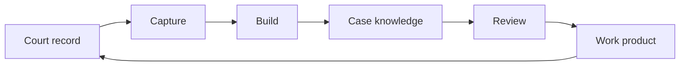
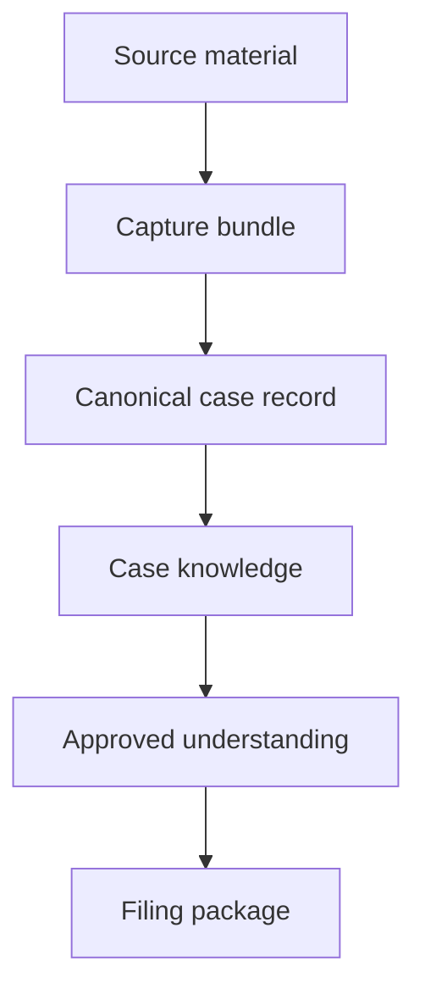
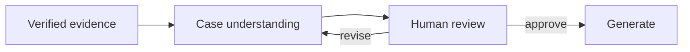
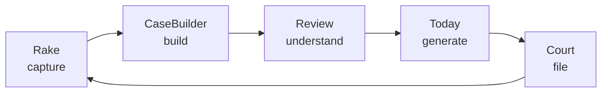

<p align="center">
  
</p>

<p align="center">
  <strong>The operating system for litigation.</strong><br />
  Build complete case knowledge from court records.
</p>

<p align="center">
  <a href="PRODUCT.md">Product</a> ·
  <a href="ARCHITECTURE.md">Architecture</a> ·
  <a href="ROADMAP.md">Roadmap</a> ·
  <a href="MANIFESTO.md">Manifesto</a> ·
  <a href="docs/adr">ADRs</a>
</p>

---

## Every lawsuit starts as a pile of documents.

Court filings. Exhibits. Docket entries. Emails. Discovery. Orders. Receipts. Photos. Prior research. Attorney notes.

A case does not become usable until someone turns that pile into understanding.

**CaseBuilder builds that understanding.**

It captures the record, reconstructs the case, makes the evidence traceable, and generates work product only after the human approves the system's understanding.

---

## The difference

Most legal software starts with drafting.

CaseBuilder starts with knowledge.

```text
Evidence before opinion.
Understanding before drafting.
Review before generation.
People before automation.
```

---

## The loop



Every new filing becomes new source material.

Every pass through the loop makes the case stronger.

---

## The product



CaseBuilder is not a chatbot.

CaseBuilder is not a one-shot generator.

CaseBuilder is the system that turns the legal record into reviewed, verified, usable case knowledge.

---

## The workspaces

<table>
  <tr>
    <td width="25%"><strong>Capture</strong><br /><br />Collect everything. Preserve the chain.</td>
    <td width="25%"><strong>Build</strong><br /><br />Explode the record. Verify the foundation.</td>
    <td width="25%"><strong>Review</strong><br /><br />Find the story inside the evidence.</td>
    <td width="25%"><strong>Generate</strong><br /><br />Produce work product from approved understanding.</td>
  </tr>
</table>

---

## Case knowledge

CaseBuilder treats filings as structured knowledge, not static PDFs.

A usable case knows:

- what was filed
- when it was filed
- who filed it
- what pages support it
- what facts are disputed
- what evidence is missing
- what contradictions matter
- what has already been reviewed
- what work product depends on it

Knowledge is not guessed.

Knowledge is built.

---

## The human gate



The system does not ask the user to trust a generated document.

It asks the user to approve the understanding first.

That is the safety model.

That is the product.

---

## The four promises

**We do not invent evidence.**

**We do not hide provenance.**

**We do not skip human review.**

**We do not ask you to trust a black box.**

---

## Project map

```text
casebuilder/
├── README.md
├── MANIFESTO.md
├── PRODUCT.md
├── ARCHITECTURE.md
├── ROADMAP.md
├── CONTRIBUTING.md
├── docs/
│   ├── adr/
│   ├── assets/
│   ├── diagrams/
│   └── product/
├── schemas/
│   ├── capture-bundle.schema.json
│   ├── canonical-case-record.schema.json
│   ├── review-packet.schema.json
│   └── filing-package.schema.json
└── packages/
    ├── capture/
    ├── build/
    ├── review/
    └── generate/
```

---

## Ecosystem



The implementation may live across multiple repositories for now.

The product is one system.

---

## Status

CaseBuilder is at the product architecture stage.

The priority is to define clean contracts between capture, build, review, and generation before collapsing implementation details into a single codebase.

---

## Vision

Every legal matter deserves a living body of verified knowledge.

Not a folder.

Not a database.

Not a pile of generated text.

A record that grows with the case.

A system that makes the facts visible.

A workflow that lets people practice law instead of reconstructing paperwork.

That is CaseBuilder.
